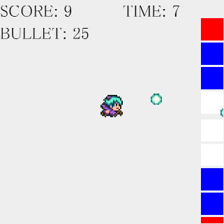

# block-shooter

Akashic Engine を利用して作ったランキング対応ニコニコ新市場コンテンツのサンプルです。



## 利用方法

Akashic Engine の開発環境を整えた後、以下を実行します。

```sh
npm install
npm run build
npm start
```

## コンテンツの内容

* 画面をタッチすることで自キャラから弾が発射されます。
* 弾を青い矩形に当てると 1 つ辺り+1 がスコアに加算されます。
  * 赤い矩形に当ててもスコアに加算されません。
* 弾数には制限回数があり、それ以上は発射できません。
* 制限時間内にできるだけ多くのスコアを出すことが目的のゲームです。

# ライセンス

本リポジトリは MIT License の元で公開されています。
詳しくは [LICENSE](./LICENSE) をご覧ください。

ただし、画像ファイルおよび音声ファイルは
[CC BY 2.1 JP](https://creativecommons.org/licenses/by/2.1/jp/) の元で公開されています。
```
